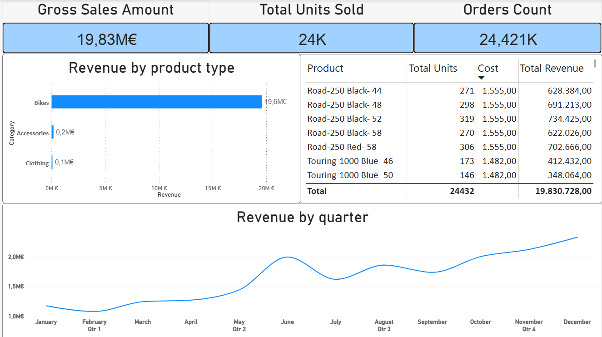

# PostgreSQL-Data-Warehouse-with-Medallion-Architecture
Building a Data Warehouse on PostgreSQL with ETL process and Data Modelling.

## Welcome to the repository!
This project demonstrates a modern data warehousing and ETL solution, from building a data warehouse using Star Schema to generating Power BI reports.

### Objectives and Project Requirements
Develop a modern data warehouse on PostgreSQL to consolidate data from different sources and create aggregations for analytics.

### Data Architecture
This project is implemented on Medallion Architecture with Bronze, Silver and Gold layers.

#### Specifications:
- **Data Sources:** Import source data from two source systems (ERP and CRM) as CSV files.
- **Data Quality:** Remove data quality issues and standardized the data prior to analysis.
- **Integration:** Integrate two sources into a user-friendly data model for analytical queries.

#### BI: Analytics & Reporting
- **Customer Behavior**
- **Sales Trends**

#### Following report was create using Power BI:

Aggregate data to enable these insights and make downstream reporting user-friendly.
